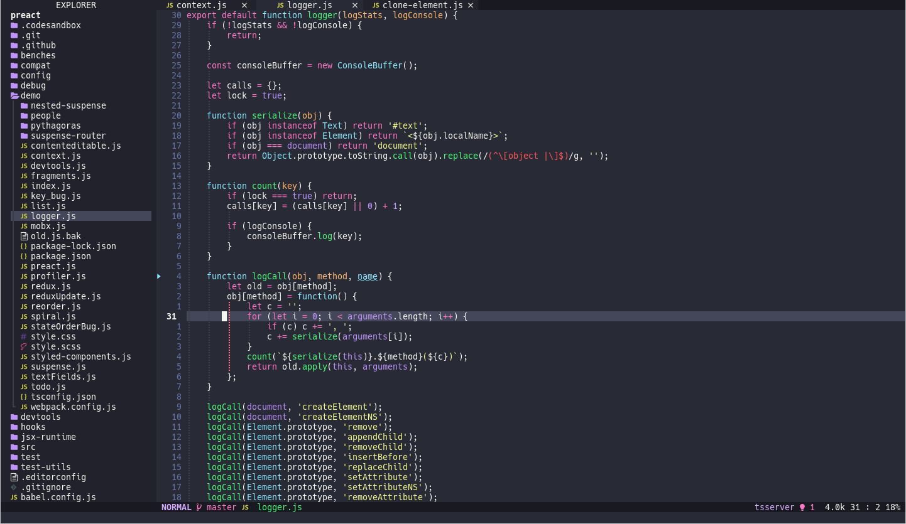
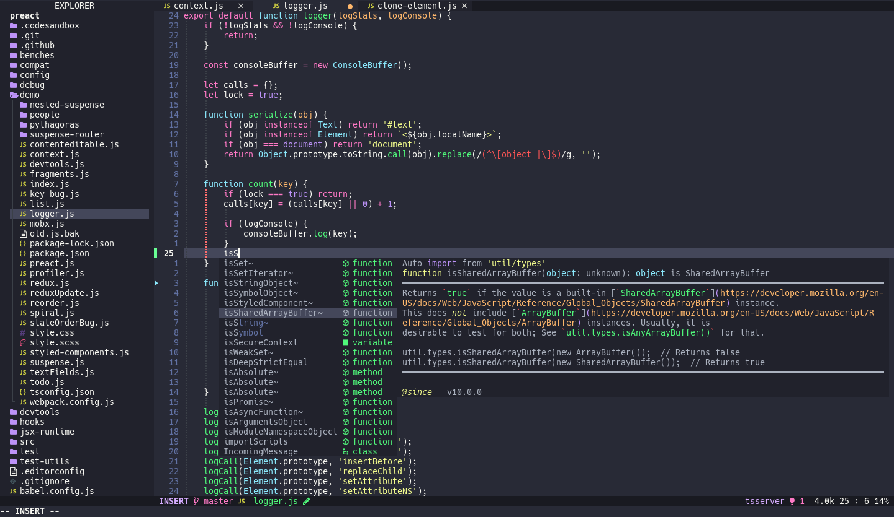
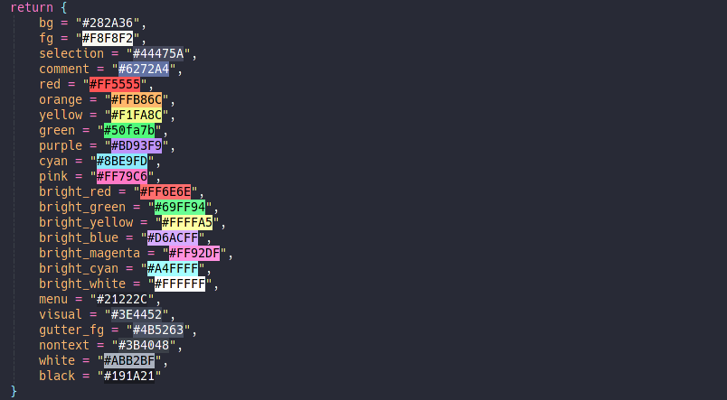

<h1 align="center" >🧛‍♂️ dracula.nvim</h1>

<p align="center"><a href="https://draculatheme.com/">Dracula</a> colorscheme for <a href="https://neovim.io/">NEOVIM</a> written in Lua</p>





## ✔️ Requirements

- Neovim >= 0.5.0
- Treesitter (optional)

## #️ Supported Plugins

- [LSP](https://github.com/neovim/nvim-lspconfig)
- [Treesitter](https://github.com/nvim-treesitter/nvim-treesitter)
- [nvim-compe](https://github.com/hrsh7th/nvim-compe)
- [nvim-cmp](https://github.com/hrsh7th/nvim-cmp)
- [Telescope](https://github.com/nvim-telescope/telescope.nvim)
- [NvimTree](https://github.com/kyazdani42/nvim-tree.lua)
- [BufferLine](https://github.com/akinsho/nvim-bufferline.lua)
- [Git Signs](https://github.com/lewis6991/gitsigns.nvim)
- [Lualine](https://github.com/hoob3rt/lualine.nvim)
- [LSPSaga](https://github.com/glepnir/lspsaga.nvim)
- [indent-blankline](https://github.com/lukas-reineke/indent-blankline.nvim)

## ⬇️ Installation

Install via package manager

```lua
-- Using Packer:
use 'Mofiqul/dracula.nvim'
```

```vim
" Using Vim-Plug:
Plug 'Mofiqul/dracula.nvim'
```

## 🚀 Usage

```lua
-- Lua:
vim.cmd[[colorscheme dracula]]
```

```vim
" Vim-Script:
colorscheme dracula
```

If you are using [`lualine`](https://github.com/hoob3rt/lualine.nvim), you can also enable the provided theme:

> Make sure to set theme as 'dracula-nvim' as dracula already exists in lualine built in themes

```lua
require('lualine').setup {
  options = {
    -- ...
    theme = 'dracula-nvim'
    -- ...
  }
}'
```

## 🔧 Configuration

If you're using lua

```lua
-- customize dracula color palette
vim.g.dracula_colors = {
  bg = "#282A36",
  fg = "#F8F8F2",
  selection = "#44475A",
  comment = "#6272A4",
  red = "#FF5555",
  orange = "#FFB86C",
  yellow = "#F1FA8C",
  green = "#50fa7b",
  purple = "#BD93F9",
  cyan = "#8BE9FD",
  pink = "#FF79C6",
  bright_red = "#FF6E6E",
  bright_green = "#69FF94",
  bright_yellow = "#FFFFA5",
  bright_blue = "#D6ACFF",
  bright_magenta = "#FF92DF",
  bright_cyan = "#A4FFFF",
  bright_white = "#FFFFFF",
  menu = "#21222C",
  visual = "#3E4452",
  gutter_fg = "#4B5263",
  nontext = "#3B4048",
}
-- show the '~' characters after the end of buffers
vim.g.dracula_show_end_of_buffer = true
-- use transparent background
vim.g.dracula_transparent_bg = true
-- set custom lualine background color
vim.g.dracula_lualine_bg_color = "#44475a"
-- set italic comment
vim.g.dracula_italic_comment = true
```

The same works in viml

```vim
" customize dracula color palette
lua << EOF
vim.g.dracula_colors = {
  bg = "#282A36",
  fg = "#F8F8F2",
  selection = "#44475A",
  comment = "#6272A4",
  red = "#FF5555",
  orange = "#FFB86C",
  yellow = "#F1FA8C",
  green = "#50fa7b",
  purple = "#BD93F9",
  cyan = "#8BE9FD",
  pink = "#FF79C6",
  bright_red = "#FF6E6E",
  bright_green = "#69FF94",
  bright_yellow = "#FFFFA5",
  bright_blue = "#D6ACFF",
  bright_magenta = "#FF92DF",
  bright_cyan = "#A4FFFF",
  bright_white = "#FFFFFF",
  menu = "#21222C",
  visual = "#3E4452",
  gutter_fg = "#4B5263",
  nontext = "#3B4048",
}
EOF
" Enable/disable animations
let bufferline.animation = v:true
" show the '~' characters after the end of buffers
let g:dracula_show_end_of_buffer = 1
" use transparent background
let g:dracula_transparent_bg = v:true
" set custom lualine background color
let g:dracula_lualine_bg_color = "#44475a"
-- set italic comment
let g:dracula_italic_comment = 1
```

## 🎨 Importing colors for other usage

```lua
require('dracula').colors()
```

This will return the folowing table


