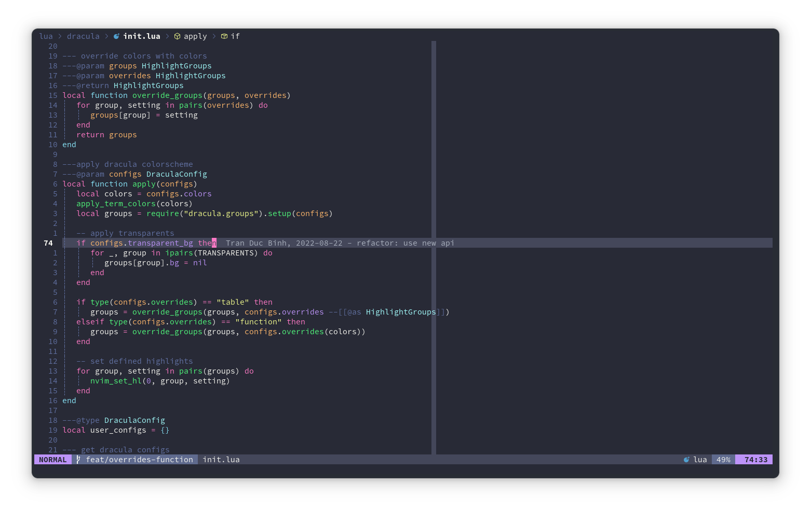

<h1 align="center" >🧛‍♂️ dracula.nvim</h1>

<p align="center"><a href="https://draculatheme.com/">Dracula</a> colorscheme for <a href="https://neovim.io/">NEOVIM</a> written in Lua</p>




## ✔️ Requirements

- Neovim >= 0.9.2
- Treesitter (optional)

NOTICE: if you use an older version of neovim (>=0.8.0 <0.9.2), you can pin this plugin to [commit 8fc749](https://github.com/Mofiqul/dracula.nvim/commit/8fc749e2479d62829c9c627867770035b74529a4)

## #️ Supported Plugins

- [LSP](https://github.com/neovim/nvim-lspconfig)
- [Treesitter](https://github.com/nvim-treesitter/nvim-treesitter)
- [nvim-compe](https://github.com/hrsh7th/nvim-compe)
- [nvim-cmp](https://github.com/hrsh7th/nvim-cmp)
- [Telescope](https://github.com/nvim-telescope/telescope.nvim)
- [NvimTree](https://github.com/kyazdani42/nvim-tree.lua)
- [NeoTree](https://github.com/nvim-neo-tree/neo-tree.nvim)
- [BufferLine](https://github.com/akinsho/nvim-bufferline.lua)
- [Git Signs](https://github.com/lewis6991/gitsigns.nvim)
- [Lualine](https://github.com/hoob3rt/lualine.nvim)
- [LSPSaga](https://github.com/glepnir/lspsaga.nvim)
- [indent-blankline](https://github.com/lukas-reineke/indent-blankline.nvim)
- [nvim-ts-rainbow](https://github.com/p00f/nvim-ts-rainbow)
- [nvim-dap-ui](https://github.com/rcarriga/nvim-dap-ui)
- [mini.indentcope](https://github.com/echasnovski/mini.indentcope)
- [mini.icons](https://github.com/echasnovski/mini.icons)

## ⬇️ Installation

Install via package manager

```lua
-- Using Packer:
use 'Mofiqul/dracula.nvim'
```

```vim
" Using Vim-Plug:
Plug 'Mofiqul/dracula.nvim'
```

## 🚀 Usage

```lua
-- Lua:
vim.cmd[[colorscheme dracula]]
-- or
vim.cmd[[colorscheme dracula-soft]]
```

```vim
" Vim-Script:
colorscheme dracula
" or:
colorscheme dracula-soft
```

If you are using [`lualine`](https://github.com/hoob3rt/lualine.nvim), you can also enable the provided theme:

> Make sure to set theme as 'dracula-nvim' as dracula already exists in lualine built in themes

```lua
require('lualine').setup {
  options = {
    -- ...
    theme = 'dracula-nvim'
    -- ...
  }
}
```

If you are using [LazyVim](https://github.com/LazyVim/LazyVim), you can add this to your plugins/colorscheme.lua file:
```lua
return {
  -- add dracula
  { "Mofiqul/dracula.nvim" },

  -- Configure LazyVim to load dracula
  {
    "LazyVim/LazyVim",
    opts = {
      colorscheme = "dracula",
    },
  },
}
```

## 🔧 Configuration

The configuration must be run before `colorscheme` command to take effect.
To customize the 'dracula-soft' variant, include `theme = 'dracula-soft'` in the `setup()` table below.

If you're using Lua:

```lua
local dracula = require("dracula")
dracula.setup({
  -- customize dracula color palette
  colors = {
    bg = "#282A36",
    fg = "#F8F8F2",
    selection = "#44475A",
    comment = "#6272A4",
    red = "#FF5555",
    orange = "#FFB86C",
    yellow = "#F1FA8C",
    green = "#50fa7b",
    purple = "#BD93F9",
    cyan = "#8BE9FD",
    pink = "#FF79C6",
    bright_red = "#FF6E6E",
    bright_green = "#69FF94",
    bright_yellow = "#FFFFA5",
    bright_blue = "#D6ACFF",
    bright_magenta = "#FF92DF",
    bright_cyan = "#A4FFFF",
    bright_white = "#FFFFFF",
    menu = "#21222C",
    visual = "#3E4452",
    gutter_fg = "#4B5263",
    nontext = "#3B4048",
    white = "#ABB2BF",
    black = "#191A21",
  },
  -- show the '~' characters after the end of buffers
  show_end_of_buffer = true, -- default false
  -- use transparent background
  transparent_bg = true, -- default false
  -- set custom lualine background color
  lualine_bg_color = "#44475a", -- default nil
  -- set italic comment
  italic_comment = true, -- default false
  -- overrides the default highlights with table see `:h synIDattr`
  overrides = {},
  -- You can use overrides as table like this
  -- overrides = {
  --   NonText = { fg = "white" }, -- set NonText fg to white
  --   NvimTreeIndentMarker = { link = "NonText" }, -- link to NonText highlight
  --   Nothing = {} -- clear highlight of Nothing
  -- },
  -- Or you can also use it like a function to get color from theme
  -- overrides = function (colors)
  --   return {
  --     NonText = { fg = colors.white }, -- set NonText fg to white of theme
  --   }
  -- end,
})
```

## 🎨 Importing colors for other usage

```lua
local colors = require('dracula').colors()
```

This will return the following table (`dracula` palette shown):


